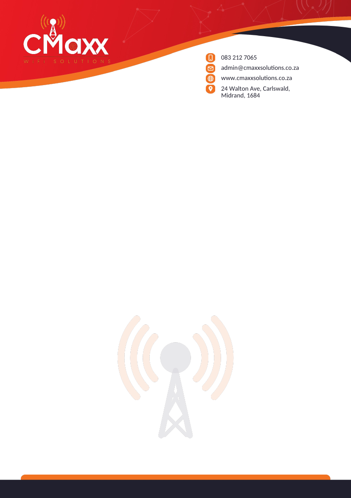
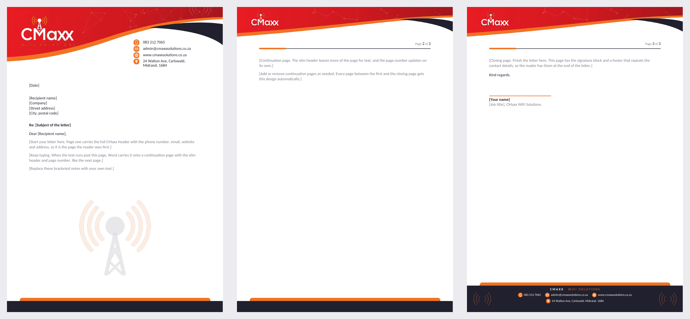

# CMaxx WiFi Solutions — Letterhead

A refreshed letterhead for CMaxx WiFi Solutions, redrawn from their current one
(`source/CMaxx Solutions Letterhead Word.docx`). It's built the same way as the Kenzo Nail Bar
letterhead in `../letterhead/`: an editable Word template, office-printer PDFs and print-shop PDFs
with bleed, plus a multi-page version.



## What changed from the current letterhead

| Current | New |
| --- | --- |
| The whole page is one flattened picture, so the phone number, email and address can't be edited | Contact details are real text in the Word header; the artwork is separate images behind it |
| The only separate logo file is 117 × 70 px (too small to print) | A 300 dpi logo extracted from the current letterhead (`assets/cmaxx-logo.png`, see `extract-logo.py`) |
| Photo of a person in the header | Replaced with a faint network-line texture, which prints cleanly and doesn't need image rights |
| Large dark watermark behind the text | Same tower and rings, lighter, so letter text stays easy to read and uses less ink |
| Footer bar sits at the paper edge, where office printers can't print | Footer band is deep enough to survive the unprintable edge, and press PDFs have 3mm bleed |

Kept: the red sweep with the orange swoosh and navy crescent, the orange contact icons, the
orange bar on navy at the foot of the page, and the brand colours sampled from the current file:
red `#EB1C24`, orange `#F37221`, navy `#21202E`.

## Files

A4 is the main size; Letter versions of everything are included too.

| File | Use |
| --- | --- |
| `CMaxx-Letterhead-A4.docx` | Single-page Word template for typing letters. |
| `CMaxx-Letterhead-A4.pdf` | Blank letterhead for an office printer. |
| `CMaxx-Letterhead-A4-PRESS.pdf` | **Send this one to a print shop.** A4 + 3mm bleed, TrimBox/BleedBox set, fonts embedded. |
| `CMaxx-Letter-MultiPage-A4.docx` | **Multi-page letter template**: first, continuation and closing pages (below). |
| `CMaxx-Letter-MultiPage-A4.pdf` / `-PRESS.pdf` | The 3-page sample for an office printer / print shop. |
| `*-preview.png` | Quick looks at the designs. |
| `assets/` | Artwork as SVG and 300 dpi PNG, the extracted logo, fonts. |
| `source/` | The current letterhead and logo as supplied. |

## Multi-page letter



| Page | Header | Footer |
| --- | --- | --- |
| **First** | Full red sweep, large logo, contact details, watermark | Orange bar on navy |
| **Middle** (continuation) | Slim red sweep, small logo, "Page X of Y" | Orange bar on navy |
| **Last** (closing) | Same slim header and page number | Deep navy band with the company name and all contact details, above a signature block |

Type from page 1. When the text overflows, Word continues it on a page with the middle-page
design. The closing page is its own Word *section* (Word can only tell "first page" apart from
"other pages"), so put the final paragraph and signature there. Page numbers update on their own.

## Printing

**Office / desktop printer** (Word file or the plain PDF)
- Print at **100% / "Actual size"**, not "Fit to page", on the matching paper size.
- Text, logo and icons sit at least 6mm in from the paper edge, so nothing important is lost in a
  printer's unprintable margin. The red sweep and navy footer band are deep enough to still show
  if the outer few millimetres print white.
- The Word files use **Calibri**, which comes with Microsoft Office on Windows and Mac.

**Print shop** (`-PRESS.pdf`)
- Trim size A4 (210 × 297mm); document size 216 × 303mm including 3mm bleed. Colour runs into the
  bleed, so there are no white slivers after cutting.
- All artwork, including the logo, is 300 dpi.
- The colours are RGB. Let the print shop convert them to CMYK with their own profile, and **ask for
  a printed proof**. Bright red and orange usually print a little duller than on screen.
- The PDFs use Carlito (SIL Open Font License, see `assets/fonts/`), a free font with exactly the
  same letter widths as Calibri, embedded so the file prints the same everywhere.

## Editing

The contact details are in `docx-parts.js` (and as live text in the Word headers). To rebuild:

```bash
python3 extract-logo.py   # source letterhead → assets/cmaxx-logo.png (needs Pillow + numpy)
node render-art.js        # SVG → assets/*.png (trim and bleed versions)
node build-letterhead.js  # → single-page A4 and Letter .docx (page geometry lives in layout.js)
node build-multipage.js   # → multi-page A4 and Letter .docx
python3 make-print.py     # → office and -PRESS PDFs (needs LibreOffice Writer + pypdf,
                          #   with Carlito installed and aliased to "Calibri" in fontconfig)
```
